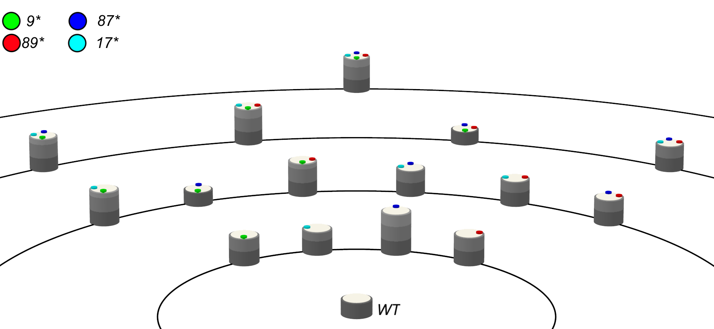
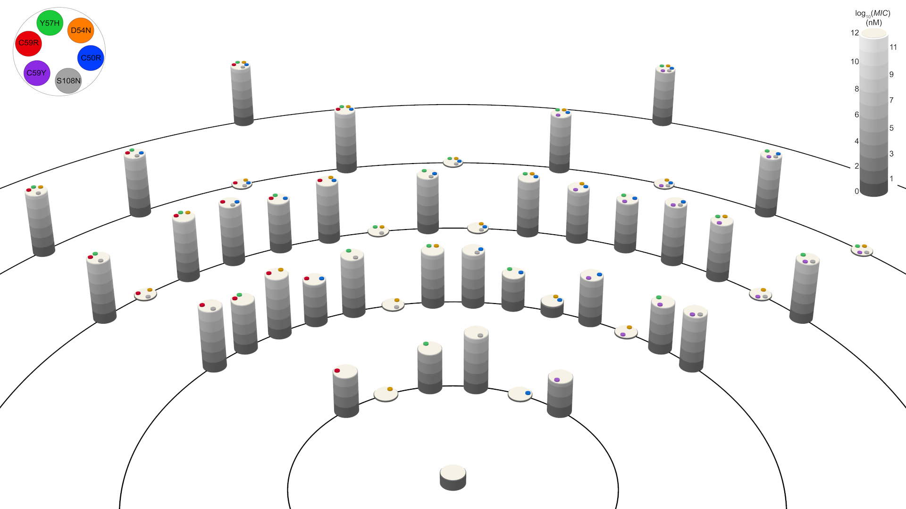

# Adaptive Seascape / Epistadium Plot 
This tool plots adaptive landscape through time.

_Prerequisites:

__-Python 2.7 or Python 3.x__

__-Vpython 6 or later. (preferably Vpython 7)___

To start plotting epistadium figures, open inputs.xlsx file and fill the excel file each row contains information for one cylinder. Brief information about columns to fill inside inputs excel file can be found below:
Sheet Name : Data __(Do not change the sheet name!)__
- Cylinder Name: This column is just to differentiate cylinders. This will not be used in the script.
- Orbital Number: Cylinders are placed on different orbitals. For example WT is 0, Single Mutants are 1, etc. 
- Order in Orbital: In each orbital there is an order between cylinders. Left most one is 0, Second from left is 1, and so on
- Mutant_Middle: If you want to put a circle in the middle put 1 for that cylinder. 
- Mutant_Periphery: There are multiple columns with Mutant header. These are the circles on the periphery of top of each cylinder. Depending on the number of variants/mutations you can fill as many as 8 of them. 
__!!! Please keep 'Mutant' word in the header for variant/mutation columns. !!! You can change the header as Mutant-1,Mutant-2 or Mutant-T1F,Mutant-Y56C etc.__
- Fitness_Condition: These are the heights of each cylinder. If you use more than one "Fitness" column, script will output multiple scenes. Each composed of heights in one Fitness Columns. If you want to make a frame animation you can fill multiple fitness columns.  
__!!! Please keep 'Fitness' word in the header for variant/mutation columns. !!! You can change the header as Fitness1, Fitness2 or Fitness-Condition1, Fitness-Condition2 etc. __

main.py does the plotting using the data provided in inputs.xlsx file. Download all files in this repo into a folder and run main.py. This file uses vpython which is not in the default distribution of anaconda python or enthought python. You can download vpython using the instruction in the link. https://vpython.org/presentation2018/install.html

For example, below figure is showing the IC99.99 values of TEM-1 beta-lactamase synonymous mutants. Each colored circle on top of cylinders show synonymous mutation(see legend on top left). Height of each cylinder here is normalized to IC99.99 values of WT. Thus, WT composed on one gray disk. If a mutant has 2 gray disks meaning it has twice resistant to CTX than WT. Check the paper in the link for more details. [https://www.nature.com/articles/s41437-018-0104-z]

Next example, is from Ravikumar et al.[https://www.sciencedirect.com/science/article/pii/S0092867418313308]. They evolved pfDHFR using their orthoRep system. In the paper (Figure 4) they showed the MIC values of 48 mutants. (Full combination of 6 mutations). This time height of the cylinders show the log10 MIC (nM) median values. In the paper they mentioned that pyrimethamine resistant quadriple mutant malaria DHFR has resistance around 1.5-2mM range. (6 disk height in the picture)   

This tool exports a *'*.pov' file as an output also opens up a ghostshell in your default browser. By using mouse, the viewing angle can be changed in the ghostshell. You can zoom in/out. Then you can take a screenshot to save the plot. 

For exporting high resolution publication figures, it is better use POV-Ray software (http://www.povray.org) and the exported pov file. POV-Ray can export pictures with different size and resolutions. 
